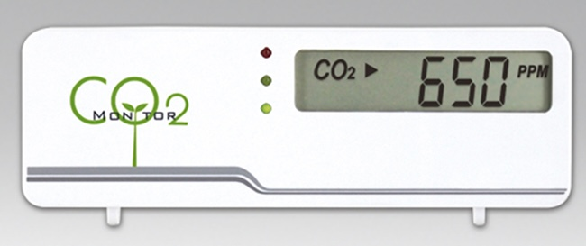

# Home Assistant Custom Component: `usb_co2`

This custom component for Home Assistant integrates CO₂ sensors based on the **USB interface**, such as **Dadget/Masterkit MT8057S USB CO₂ meters**. It automatically detects compatible USB devices and exposes both CO₂ and temperature readings as sensor entities.


## Features

- 🟢 Automatic discovery of supported USB-connected CO₂ meters
- 🌡️ Exposes CO₂ and temperature as Home Assistant sensor entities
- 🛠️ No configuration required for basic usage

## Supported Devices

This component is compatible with Dadget/Masterkit MT8057S USB CO₂ meters based on ZyAura ZG01 module using HID protocol

## Installation

### Option 1: Install via HACS (Recommended)

1. Go to **HACS → Integrations → ⋮ (Menu) → Custom Repositories**
2. Add the repository URL and select category **Integration**:

    ```
    https://github.com/devbis/hass_usb_co2
    ```

3. Then follow steps 2–4 above.

### Option 2: Manual Installation

1. Download or clone this repository.
2. Copy the `usb_co2` directory to your Home Assistant `custom_components` folder:

    ```bash
    /config/custom_components/usb_co2/
    ```

3. Restart Home Assistant.

---

## Configuration

Add USB CO2 integration via the Home Assistant UI.
If the device is connected, it will create entities automatically.

## Entities Created

For each detected USB CO₂ device, the following sensors will appear:

- `sensor.<model>_co2` — CO₂ concentration in ppm
- `sensor.<model>_temperature` — Temperature in °C

> Example:
> ```
> sensor.usb_zytemp_1_40_co2: 426 ppm
> sensor.usb_zytemp_1_40_temperature: 22.5 °C
> ```

---

## Logging & Debugging

Enable debug logs to troubleshoot or verify data:

```yaml
logger:
  logs:
    custom_components.usb_co2: debug
